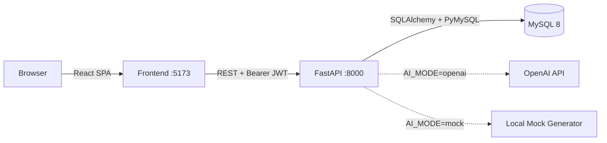

# Event Manager AI

Hệ thống quản lý sự kiện tích hợp AI.

Event Manager AI là ứng dụng web hỗ trợ quản lý vòng đời sự kiện, diễn giả, lịch trình, đăng ký, vé QR, check-in, phản hồi, thống kê và ba chức năng AI. AI không tự điều hành hệ thống: người dùng vẫn kiểm soát dữ liệu và thao tác publish.

## Chức năng chính

- Authentication bằng JWT và phân quyền backend theo role.
- Đăng ký tài khoản công khai an toàn cho `ATTENDEE`; `ADMIN` quản lý tài khoản, role và trạng thái active.
- Quản lý Event, Speaker và Schedule/Session.
- Đăng ký, hủy đăng ký, đăng ký lại và phát hành Ticket tự động.
- Hiển thị QR Ticket có xác thực; check-in bằng camera hoặc nhập ticket code.
- Feedback sau check-in và Analytics theo Event.
- Announcement dạng `DRAFT`/`PUBLISHED` cho attendee đang đăng ký.
- AI Announcement Draft, AI Feedback Summary và Event AI Chatbot ở Mock Mode hoặc OpenAI Mode.

## Vai trò người dùng

| Role | Chức năng chính |
|---|---|
| `ADMIN` | Quản lý tài khoản người dùng, mọi Event và dữ liệu liên quan; Analytics, Announcement và AI. |
| `ORGANIZER` | Quản lý Event do mình sở hữu cùng Speaker, Schedule, danh sách đăng ký, Analytics, Announcement và AI. |
| `STAFF` | Dùng Staff Check-in Workspace, chọn Event `PUBLISHED`, quét QR hoặc nhập ticket code; không có Event CRUD. |
| `ATTENDEE` | Xem Event `PUBLISHED`, đăng ký/hủy/đăng ký lại, xem Ticket/QR, gửi Feedback và đọc Announcement. |

Giao diện được tách thành Management Workspace (`ADMIN`, `ORGANIZER`), Staff Check-in Workspace và Attendee Workspace.

## Công nghệ sử dụng

| Layer | Technology | Purpose |
|---|---|---|
| Frontend | React 18, Vite 5, JavaScript, CSS | Single-page application và QR scanner |
| Backend | FastAPI, Uvicorn, Python 3.12 | REST API, authentication, RBAC và business rules |
| ORM | SQLAlchemy 2 | Ánh xạ và truy vấn dữ liệu |
| Database | MySQL 8 | Lưu dữ liệu nghiệp vụ |
| Container | Docker Compose | Khởi chạy frontend, backend và database |
| Authentication | JWT, bcrypt | Session token và password hashing |
| AI | OpenAI API hoặc Mock Mode | Tạo Announcement draft, tóm tắt Feedback và hỏi đáp theo Event |

## Kiến trúc tổng quan



Browser không gọi OpenAI trực tiếp. `OPENAI_API_KEY` chỉ được đọc ở backend. Database gồm 9 bảng: `users`, `events`, `speakers`, `schedules`, `registrations`, `tickets`, `checkins`, `feedbacks`, `announcements`; không có bảng AI riêng.

## Luồng nghiệp vụ chính

```mermaid
flowchart LR
    Manage[Admin / Organizer] --> Event[Create Event]
    Event --> Content[Speaker + Schedule]
    Content --> Publish[Publish]
    Publish --> Register[Attendee registers]
    Register --> Ticket[ACTIVE Ticket + QR]
    Ticket --> CheckIn[Staff CheckIn]
    CheckIn --> Feedback[Attendee Feedback]
    Feedback --> Analytics[Analytics + AI Summary]
```



Một số quyết định thiết kế quan trọng:

- Speaker là dữ liệu của Event, không phải User.
- Schedule tương ứng với một Session; Session phải nằm trong thời gian Event, nhưng các Session song song được phép.
- QR payload là `ticket_code`; CheckIn record là nguồn xác định attendance.
- Ticket vẫn `ACTIVE` sau check-in. Hủy registration chuyển Ticket sang `VOID`; đăng ký lại tái sử dụng registration và Ticket cũ.
- Announcement recipient được xác định động từ registration đang `REGISTERED`.
- AI Feedback Summary chạy on-demand; AI Announcement Draft chỉ điền bản nháp và không tự lưu/publish.
- Event AI Chatbot chỉ trả lời từ Event, Speaker và Schedule được backend cấp quyền; hội thoại chỉ nằm trong state của frontend và không được lưu vào database.

## Cấu trúc project

```text
event-manager-ai-v2/
├── backend/
│   ├── app/              # API, models, schemas, services, core và database
│   ├── scripts/          # Demo data utility
│   └── tests/            # Regression/smoke scripts
├── frontend/
│   └── src/              # React pages, components và API client
├── docs/                 # Documentation Pack
├── docker-compose.yml
├── .env.example
└── README.md
```

## Quick Start

Yêu cầu: Git, Docker Desktop/Docker Engine, Docker Compose và browser hiện đại. Docker là cách chạy được khuyến nghị; không cần cài Node.js, Python hoặc MySQL trên host.

```text
git clone <repository-url>
cd event-manager-ai-v2
```

Windows PowerShell:

```powershell
Copy-Item .env.example .env
```

Linux/macOS/Git Bash:

```bash
cp .env.example .env
```

Đổi các giá trị mẫu trong `.env`, đặc biệt là password và `JWT_SECRET_KEY`, rồi chạy:

```text
docker compose up -d --build
docker compose ps
```

Compose tự chờ MySQL healthy, backend healthy, rồi mới khởi động frontend. Schema được backend tạo tự động; không cần chạy SQL thủ công.

## Cấu hình môi trường

| Variable | Ý nghĩa |
|---|---|
| `MYSQL_DATABASE`, `MYSQL_USER`, `MYSQL_PASSWORD` | Database và tài khoản ứng dụng |
| `MYSQL_ROOT_PASSWORD` | Root password để MySQL container khởi tạo |
| `JWT_SECRET_KEY` | Secret dài, ngẫu nhiên để ký JWT |
| `JWT_ALGORITHM` | Hiện chỉ hỗ trợ `HS256` |
| `JWT_ACCESS_TOKEN_EXPIRE_MINUTES` | Thời hạn access token, phải lớn hơn 0 |
| `AI_MODE` | `mock` (mặc định) hoặc `openai` |
| `OPENAI_API_KEY` | Chỉ cần khi `AI_MODE=openai`; không commit giá trị thật |
| `OPENAI_MODEL` | Model backend sử dụng trong OpenAI Mode |
| `FRONTEND_URL` | Allowed origin chính cho backend CORS trong production |
| `CORS_ORIGINS` | Danh sách origin bổ sung cho backend CORS |
| `VITE_API_BASE_URL` | Backend URL cho frontend; Compose đặt là `http://localhost:8000` |

Trong Docker, backend luôn kết nối MySQL qua hostname `db`, không phải `localhost`. Xem cấu hình chi tiết tại [docs/SETUP.md](docs/SETUP.md).

## Truy cập hệ thống

| Service | URL |
|---|---|
| Frontend | http://localhost:5173 |
| Backend | http://localhost:8000 |
| Swagger UI | http://localhost:8000/docs |
| API health | http://localhost:8000/api/health |
| Database health | http://localhost:8000/api/health/database |
| MySQL host port | `localhost:3306` |

## Production Deployment

Kiến trúc production được khuyến nghị:

- Frontend: Vercel
- Backend: Render hoặc Railway
- Database: MySQL managed service

URLs cần chuẩn bị sau khi deploy:

- Frontend URL: `https://<your-vercel-app>.vercel.app`
- Backend URL: `https://<your-backend-service>`
- Health URL: `https://<your-backend-service>/api/health`

Environment variables cần có:

### Frontend

- `VITE_API_BASE_URL=https://<your-backend-service>`

### Backend

- `MYSQL_HOST`
- `MYSQL_PORT`
- `MYSQL_DATABASE`
- `MYSQL_USER`
- `MYSQL_PASSWORD`
- `JWT_SECRET_KEY`
- `JWT_ALGORITHM`
- `JWT_ACCESS_TOKEN_EXPIRE_MINUTES`
- `AI_MODE=mock`
- `OPENAI_API_KEY`
- `OPENAI_MODEL`
- `FRONTEND_URL=https://<your-vercel-app>.vercel.app`
- `CORS_ORIGINS=https://<your-vercel-app>.vercel.app,http://localhost:3000,http://localhost:5173,http://127.0.0.1:5173`

Lưu ý:

- Không hard-code URL production trong component frontend.
- Không commit secret, password hoặc database URL production vào Git.
- Local vẫn giữ nguyên `docker compose up --build`.

## AI Modes

- `AI_MODE=mock`: không cần OpenAI key, phù hợp demo offline/local và phải được giới thiệu đúng là Mock Mode.
- `AI_MODE=openai`: cần `OPENAI_API_KEY`, `OPENAI_MODEL` và kết nối ngoài. Frontend vẫn chỉ gọi FastAPI.

AI output mang tính hỗ trợ. Người dùng phải review Announcement draft và tự chọn Save Draft hoặc Publish. Chatbot hiển thị rõ nguồn `mock`/`openai`, không gửi attendee, registration, Ticket hay dữ liệu xác thực vào AI context.

## Testing

Production frontend build trong container:

```text
docker compose run --rm frontend npm run build
```

Smoke/E2E scripts nằm trong `backend/tests/`. Cách chạy bằng backend container được mô tả tại [docs/SETUP.md](docs/SETUP.md#chạy-regression-scripts).

## Bảo mật

- Password được hash bằng bcrypt; authentication dùng JWT.
- Backend thực thi role và Event ownership; UI không phải lớp phân quyền duy nhất.
- Role và trạng thái active trong database là nguồn phân quyền hiện hành; token cũ không giữ lại quyền đã bị thu hồi.
- Public registration không nhận role từ client; chỉ `ADMIN` được tạo/cập nhật tài khoản có role đặc quyền.
- Secrets được truyền qua environment và `.env` bị Git ignore.
- OpenAI key chỉ thuộc backend.

Các biện pháp trên phù hợp phạm vi đồ án; repository không tuyên bố đã qua production security audit đầy đủ.

## Tài liệu chi tiết

- [Setup và vận hành](docs/SETUP.md)
- [Kiến trúc hệ thống](docs/ARCHITECTURE.md)
- [Modules và business rules](docs/MODULES.md)
- [API Summary](docs/API_SUMMARY.md)
- [Software Requirements Specification](docs/SRS.md)
- [Use Case Model](docs/USE_CASES.md)
- [UML Diagrams](docs/UML_DIAGRAMS.md)
- [Final Database ERD](docs/FINAL_ERD.md)
- [Demo Guide](docs/DEMO_GUIDE.md)
- [Troubleshooting](docs/TROUBLESHOOTING.md)
- [Final Defense Guide](docs/DEFENSE_GUIDE.md)
- [Defense Q&A — 60 câu](docs/DEFENSE_QA.md)
- [Demo Checklist và Cheat Sheet](docs/DEMO_CHECKLIST.md)
- [Release Notes v1.1.0](RELEASE_NOTES.md)
- [Release và Submission Checklist](docs/RELEASE_CHECKLIST.md)

## Phạm vi hiện tại

Đây là hệ thống quy mô vừa cho đồ án học phần, ưu tiên nghiệp vụ rõ ràng và triển khai Docker đơn giản. Phạm vi hiện tại không gồm payment, email delivery, Event–Staff assignment, seat booking, public portal không cần đăng nhập hoặc calendar scheduling nâng cao. Event AI Chatbot dùng structured Event context hiện có; project không có vector database, embedding retrieval, RAG platform, long-term chat memory hay recommendation engine.
