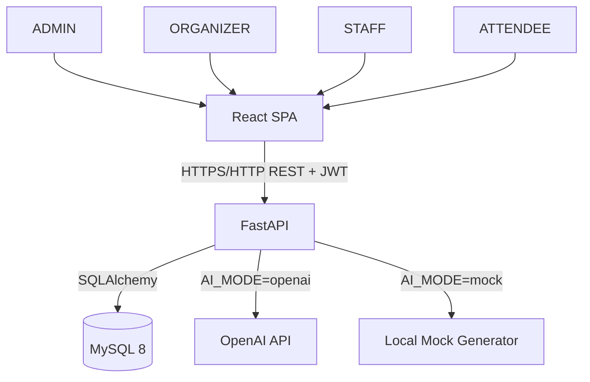
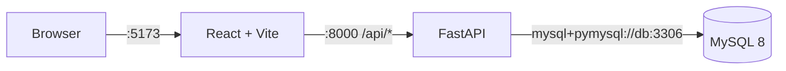
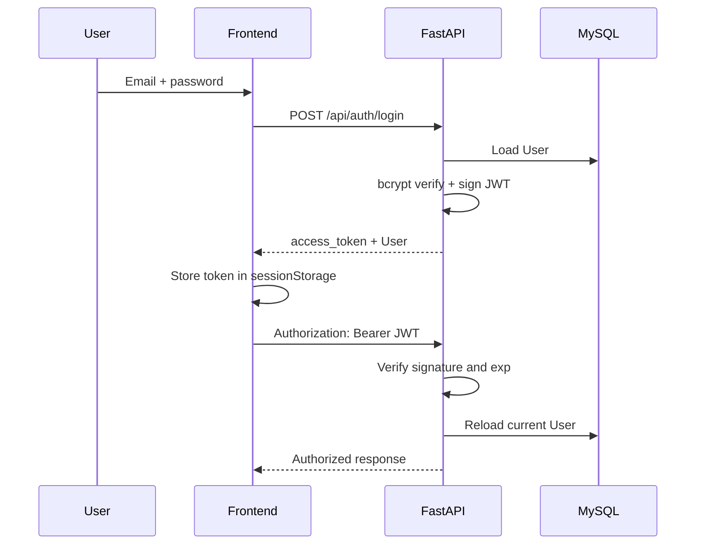
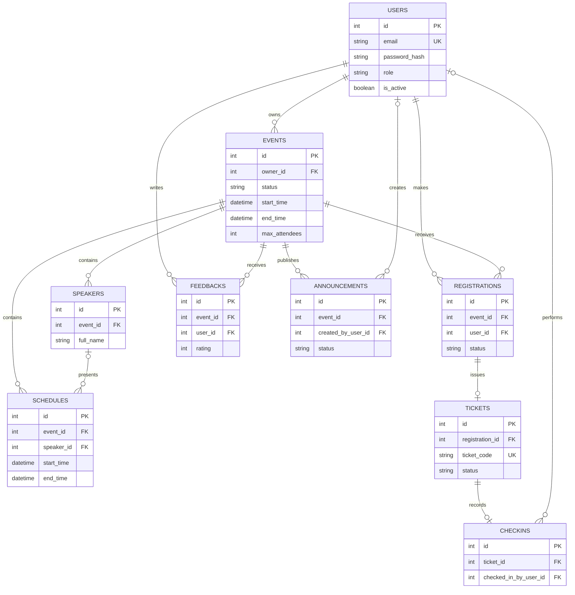
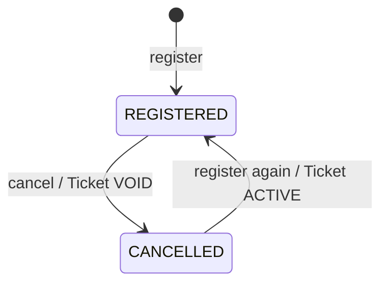
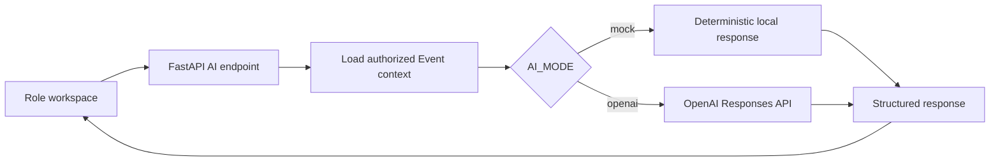
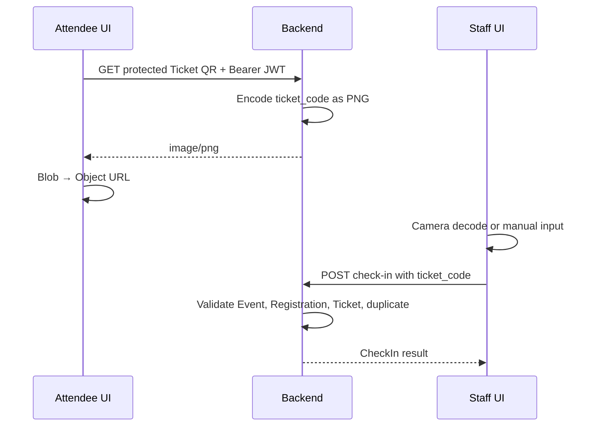

# Kiến trúc hệ thống

## System context

Event Manager AI phục vụ bốn role: `ADMIN`, `ORGANIZER`, `STAFF`, `ATTENDEE`. Tất cả dùng browser để truy cập React SPA. Frontend gọi FastAPI bằng REST/JSON và Bearer JWT; FastAPI truy cập MySQL bằng SQLAlchemy/PyMySQL và tùy chọn gọi OpenAI từ backend.

## Runtime layers

Docker Compose health dependency theo thứ tự `db` → `backend` → `frontend`. Database dùng named volume `mysql_data`.

## Authentication flow

JWT chứa `sub`, email, role, issued/expiry time, nhưng backend vẫn tải User từ database ở mỗi protected request. Trạng thái active và role trong database là source of truth cho authorization.

## RBAC và ownership

Ký hiệu: `Own` = chỉ Event do Organizer sở hữu; `All` = mọi Event; `Operate` = thao tác vận hành check-in.

| Capability | ADMIN | ORGANIZER | STAFF | ATTENDEE |
|---|---|---|---|---|
| Event CRUD | All | Own | — | — |
| Speaker CRUD | All | Own | — | — |
| Schedule CRUD | All | Own | — | — |
| Registration/Ticket management list | All | Own | — | Own attendee data |
| Check-in create | Operate | Own Event | Published Events | — |
| Check-in list | All | Own | — | — |
| Feedback | Read All | Read Own Event | — | Own CRUD khi eligible |
| Analytics | All | Own | — | — |
| Announcement management | All | Own | — | Published for active registrations |
| AI Feedback/Announcement | All | Own | — | — |
| Event AI Chatbot | All | Own | Published Events | Published Events |

`get_event_for_management()` lọc `owner_id` đối với Organizer. Cross-owner access không trả dữ liệu Event của Organizer khác.

## Database ERD

Database có đúng 9 bảng nghiệp vụ. AI chạy on-demand và không có bảng riêng.

### Quan hệ và delete rules

- Xóa Event cascade Speaker, Schedule, Registration, Feedback và Announcement; Ticket và CheckIn bị xóa gián tiếp qua Registration/Ticket.
- Xóa Speaker giữ Schedule và đặt `speaker_id` thành `NULL`.
- Xóa Announcement creator giữ Announcement và đặt `created_by_user_id` thành `NULL`.
- Mỗi cặp Event/User chỉ có một Registration và một Feedback.
- Một Registration có tối đa một Ticket; một Ticket có tối đa một CheckIn.

## Lifecycle

### Event

Các trạng thái được chấp nhận: `DRAFT`, `PUBLISHED`, `CANCELLED`, `COMPLETED`. Chỉ Event `PUBLISHED` xuất hiện trong Attendee browse và Staff check-in selection.

### Registration và Ticket

Registration được tái sử dụng khi đăng ký lại. Ticket id/code ổn định nếu Ticket đã tồn tại. Registration đã check-in không thể cancel.

### Check-in

Check-in cần Event `PUBLISHED`, Registration `REGISTERED`, Ticket `ACTIVE` và ticket code thuộc đúng Event. CheckIn record mới là attendance source; Ticket không đổi sang trạng thái khác sau check-in. Unique constraint ngăn check-in trùng.

### Feedback

Attendee chỉ tạo Feedback khi có Registration `REGISTERED`, Ticket và CheckIn của đúng Event; Event phải `PUBLISHED` hoặc `COMPLETED`. Mỗi Event/User có tối đa một Feedback, sau đó attendee có thể xem, sửa hoặc xóa Feedback của mình.

### Announcement

Announcement có `DRAFT` hoặc `PUBLISHED`. Attendee chỉ thấy bản `PUBLISHED` của Event mà registration hiện là `REGISTERED`. Không có recipient table; tập người nhận được truy vấn động.

## AI architecture

- AI Feedback Summary đọc aggregate và tối đa 100 comment gần nhất. Payload gửi cho service không gồm User object/email; summary không được lưu vào database.
- AI Announcement Draft dùng Event và tối đa 20 Schedule làm context. Endpoint chỉ trả `title`/`content`; không tạo Announcement và không publish.
- Event AI Chatbot dùng Event, Speaker và Schedule đã được authorize làm context. User question và dữ liệu Event đều được coi là untrusted; endpoint chống prompt injection, không gửi PII và không ghi database.
- Chatbot là stateless ở backend; message chỉ nằm trong React state và được xóa khi đổi Event. Không có vector database, embedding retrieval, RAG platform hoặc long-term chat memory.
- OpenAI request dùng structured JSON schema, `store=False`, timeout và giới hạn retry. `OPENAI_API_KEY` không ra frontend.

## QR và Check-in architecture

Camera và manual input cùng dùng một check-in endpoint; scanner không tạo business rule thứ hai.
