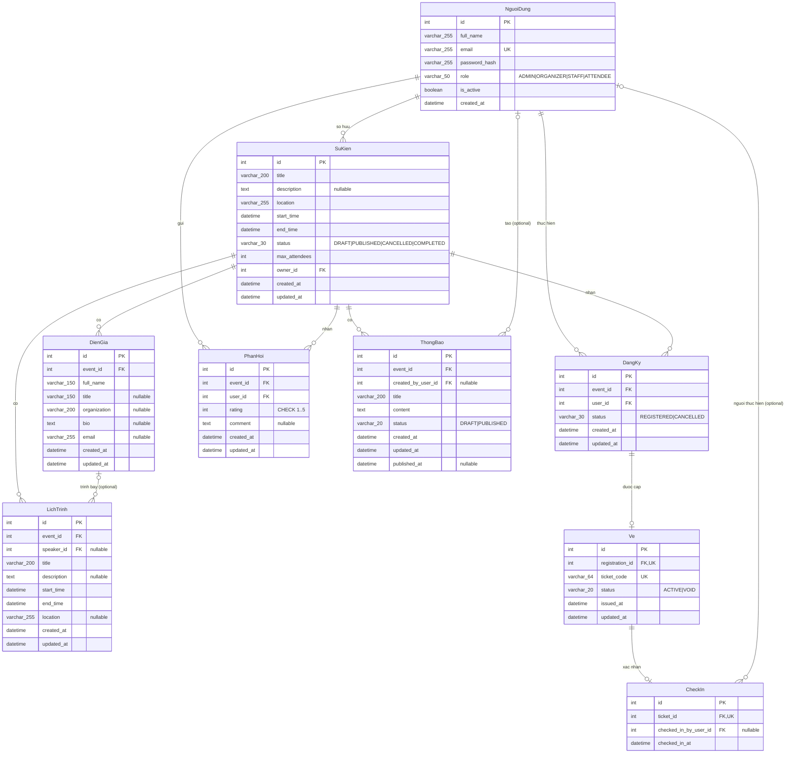

# Event Manager AI v1.1.0 — Final Database ERD

Tài liệu này mô tả schema hiện tại; không đề xuất migration hoặc thay đổi database.

## Logical Vietnamese ↔ physical mapping

| Logical entity | Physical table |
|---|---|
| `NguoiDung` | `users` |
| `SuKien` | `events` |
| `DienGia` | `speakers` |
| `LichTrinh` | `schedules` |
| `DangKy` | `registrations` |
| `Ve` | `tickets` |
| `CheckIn` | `checkins` |
| `PhanHoi` | `feedbacks` |
| `ThongBao` | `announcements` |

## Mermaid ERD — logical Vietnamese representation



Composite unique constraints không được biểu diễn thành field giả trong Mermaid: `DangKy` có `UNIQUE(event_id,user_id)` và `PhanHoi` có `UNIQUE(event_id,user_id)`.

## dbdiagram.io — physical database representation

```dbml
Table users as NguoiDung {
  id integer [pk, increment]
  full_name varchar(255) [not null]
  email varchar(255) [not null, unique]
  password_hash varchar(255) [not null]
  role varchar(50) [not null, default: 'ATTENDEE', note: 'ADMIN | ORGANIZER | STAFF | ATTENDEE']
  is_active boolean [not null, default: true]
  created_at datetime [not null, default: `now()`]

  Note: 'Logical: NguoiDung; physical: users'
}

Table events as SuKien {
  id integer [pk, increment]
  title varchar(200) [not null]
  description text
  location varchar(255) [not null]
  start_time datetime [not null]
  end_time datetime [not null]
  status varchar(30) [not null, default: 'DRAFT', note: 'DRAFT | PUBLISHED | CANCELLED | COMPLETED']
  max_attendees integer [not null, default: 100]
  owner_id integer [not null]
  created_at datetime [not null, default: `now()`]
  updated_at datetime [not null, default: `now()`]

  indexes {
    owner_id
  }
  Note: 'Logical: SuKien; physical: events'
}

Table speakers as DienGia {
  id integer [pk, increment]
  event_id integer [not null]
  full_name varchar(150) [not null]
  title varchar(150)
  organization varchar(200)
  bio text
  email varchar(255)
  created_at datetime [not null, default: `now()`]
  updated_at datetime [not null, default: `now()`]

  indexes {
    event_id
  }
  Note: 'Logical: DienGia; physical: speakers. Speaker is not a User.'
}

Table schedules as LichTrinh {
  id integer [pk, increment]
  event_id integer [not null]
  speaker_id integer
  title varchar(200) [not null]
  description text
  start_time datetime [not null]
  end_time datetime [not null]
  location varchar(255)
  created_at datetime [not null, default: `now()`]
  updated_at datetime [not null, default: `now()`]

  indexes {
    event_id
    speaker_id
  }
  Note: 'Logical: LichTrinh; physical: schedules. Schedule = Session.'
}

Table registrations as DangKy {
  id integer [pk, increment]
  event_id integer [not null]
  user_id integer [not null]
  status varchar(30) [not null, default: 'REGISTERED', note: 'REGISTERED | CANCELLED']
  created_at datetime [not null, default: `now()`]
  updated_at datetime [not null, default: `now()`]

  indexes {
    event_id
    user_id
    (event_id, user_id) [unique, name: 'uq_registrations_event_user']
  }
  Note: 'Logical: DangKy; physical: registrations. QR is not stored here.'
}

Table tickets as Ve {
  id integer [pk, increment]
  registration_id integer [not null, unique]
  ticket_code varchar(64) [not null, unique]
  status varchar(20) [not null, default: 'ACTIVE', note: 'ACTIVE | VOID']
  issued_at datetime [not null, default: `now()`]
  updated_at datetime [not null, default: `now()`]

  Note: 'Logical: Ve; physical: tickets. QR is generated on demand from ticket_code.'
}

Table checkins as CheckIn {
  id integer [pk, increment]
  ticket_id integer [not null, unique]
  checked_in_by_user_id integer
  checked_in_at datetime [not null, default: `now()`]

  indexes {
    checked_in_by_user_id
  }
  Note: 'Logical: CheckIn; physical: checkins. This row is the attendance source.'
}

Table feedbacks as PhanHoi {
  id integer [pk, increment]
  event_id integer [not null]
  user_id integer [not null]
  rating integer [not null, note: 'CHECK rating >= 1 AND rating <= 5']
  comment text
  created_at datetime [not null, default: `now()`]
  updated_at datetime [not null, default: `now()`]

  indexes {
    event_id
    user_id
    (event_id, user_id) [unique, name: 'uq_feedbacks_event_user']
  }
  Note: 'Logical: PhanHoi; physical: feedbacks'
}

Table announcements as ThongBao {
  id integer [pk, increment]
  event_id integer [not null]
  created_by_user_id integer
  title varchar(200) [not null]
  content text [not null]
  status varchar(20) [not null, default: 'DRAFT', note: 'DRAFT | PUBLISHED']
  created_at datetime [not null, default: `now()`]
  updated_at datetime [not null, default: `now()`]
  published_at datetime

  indexes {
    event_id
    created_by_user_id
  }
  Note: 'Logical: ThongBao; physical: announcements'
}

Ref: events.owner_id > users.id
Ref: speakers.event_id > events.id [delete: cascade]
Ref: schedules.event_id > events.id [delete: cascade]
Ref: schedules.speaker_id > speakers.id [delete: set null]
Ref: registrations.event_id > events.id [delete: cascade]
Ref: registrations.user_id > users.id [delete: cascade]
Ref: tickets.registration_id > registrations.id [delete: cascade]
Ref: checkins.ticket_id > tickets.id [delete: cascade]
Ref: checkins.checked_in_by_user_id > users.id [delete: set null]
Ref: feedbacks.event_id > events.id [delete: cascade]
Ref: feedbacks.user_id > users.id [delete: cascade]
Ref: announcements.event_id > events.id [delete: cascade]
Ref: announcements.created_by_user_id > users.id [delete: set null]
```

## Relationship and delete-rule summary

- `NguoiDung 1:N SuKien`: `events.owner_id` bắt buộc; FK không khai báo cascade, nên không xóa được owner khi Event còn tham chiếu.
- `SuKien 1:N DienGia` và `SuKien 1:N LichTrinh`: xóa Event cascade cả hai.
- `DienGia 0..1:N LichTrinh`: Speaker optional trên mỗi Schedule; xóa Speaker giữ Schedule và đặt `speaker_id = NULL`.
- `NguoiDung 1:N DangKy` và `SuKien 1:N DangKy`: `(event_id,user_id)` unique.
- `DangKy 1:0..1 Ve`: `registration_id` unique; QR không nằm trong Registration và được tạo on-demand từ `ticket_code`.
- `Ve 1:0..1 CheckIn`: `ticket_id` unique; CheckIn record là attendance source.
- `NguoiDung 0..1:N CheckIn`: người thực hiện có thể null; xóa User đặt `checked_in_by_user_id = NULL`.
- `NguoiDung 1:N PhanHoi` và `SuKien 1:N PhanHoi`: `(event_id,user_id)` unique, rating có CHECK 1–5.
- `SuKien 1:N ThongBao`; creator là optional. Xóa creator giữ Announcement và đặt `created_by_user_id = NULL`.
- Xóa Registration cascade Ticket rồi cascade CheckIn. Xóa Event cascade Registration nên Ticket/CheckIn cũng bị xóa gián tiếp.

## AI data note

Ba AI feature dùng dữ liệu của 9 bảng hiện hữu và không cần AI table:

- AI Announcement Draft: `events + schedules → generated draft`.
- AI Feedback Summary: `feedbacks → summary`.
- Event AI Chatbot: `events + speakers + schedules → answer`.

Không tồn tại bảng `AI`, `FAQ`, `ChatMessage` hoặc `Embedding`. AI output chạy on-demand; chatbot không có long-term database memory.
