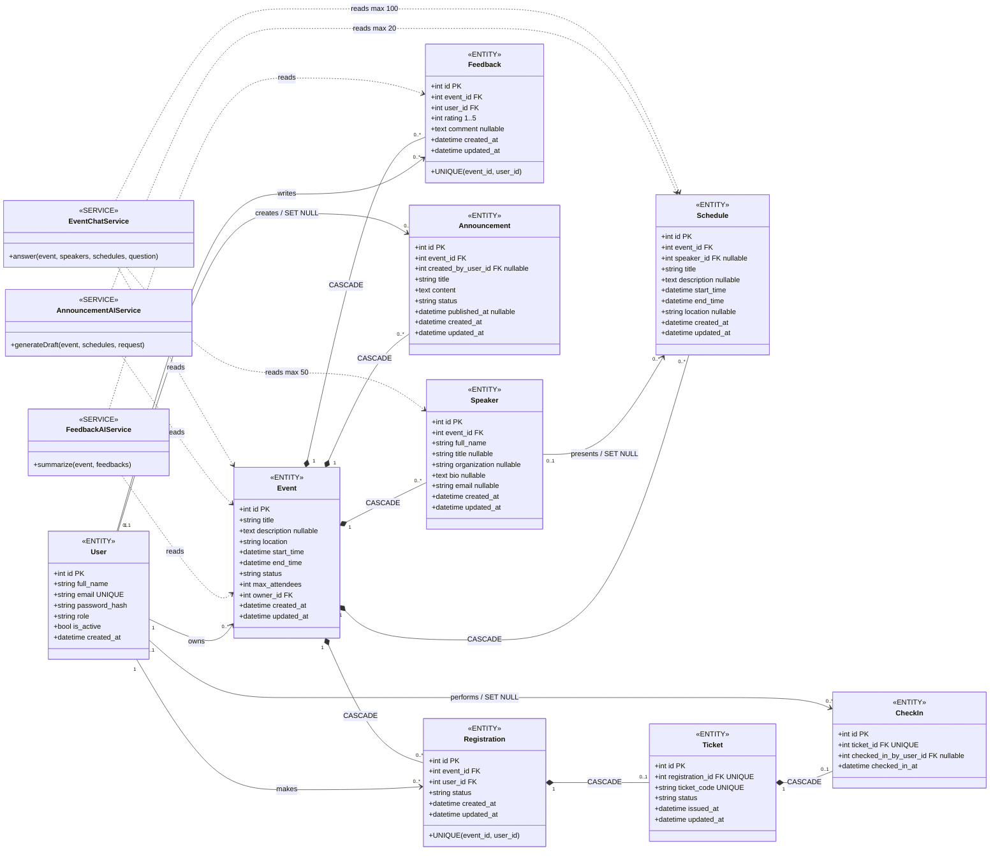
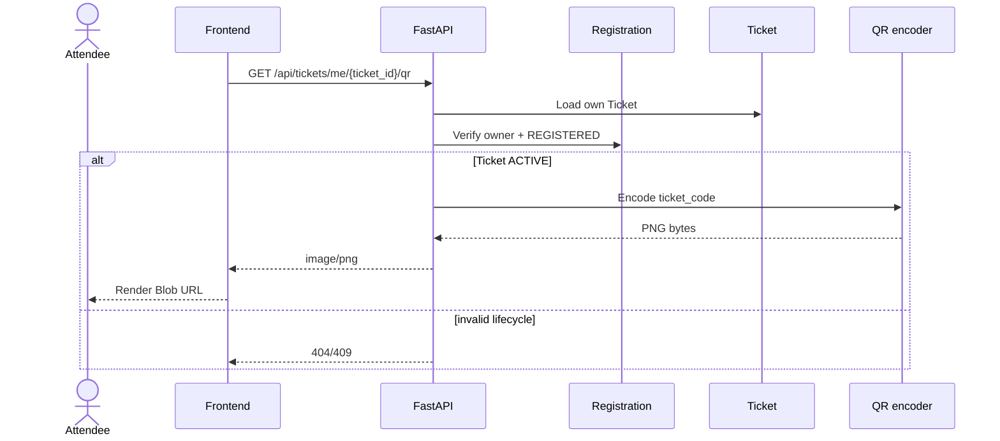
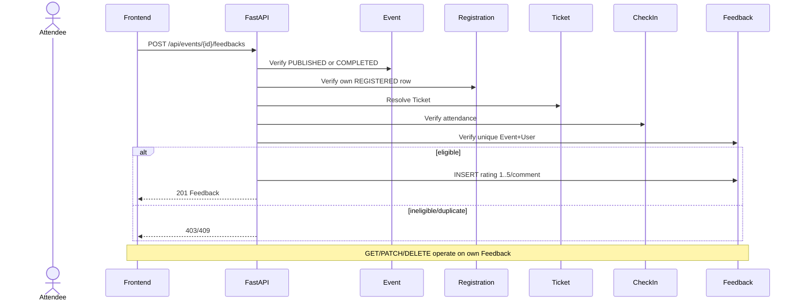
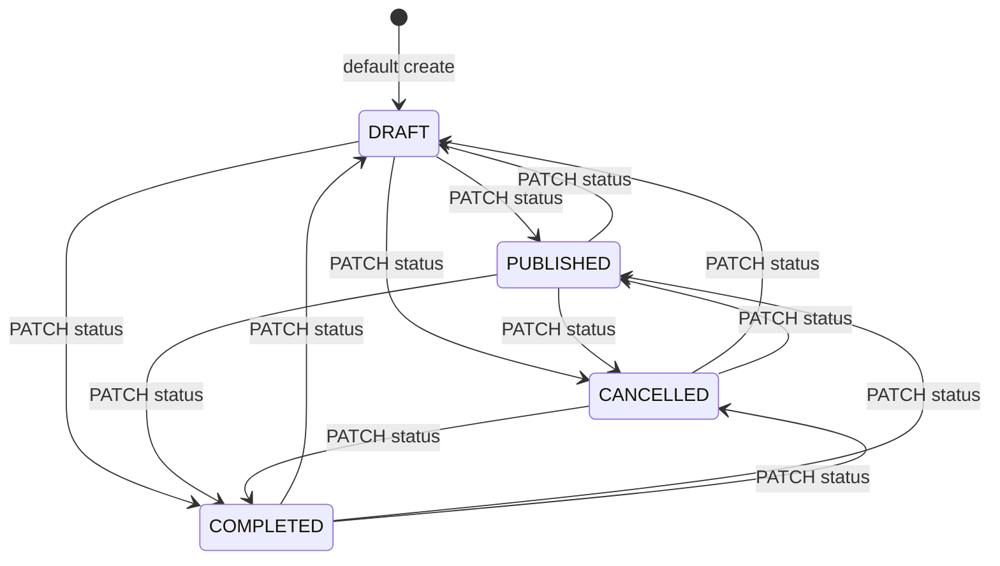
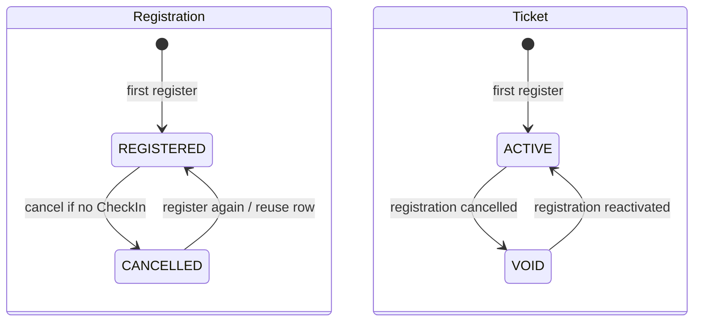
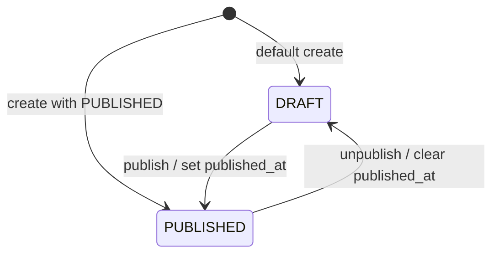

# Event Manager AI v1.1.0 — UML Diagrams

Tài liệu này đồng bộ với SQLAlchemy models, FastAPI routes và service modules hiện tại. Chín class có stereotype `ENTITY` tương ứng đúng chín bảng. AI service có stereotype `SERVICE`, xử lý on-demand và không phải entity, table hoặc state machine.

## 1. Class/domain model



`Speaker` là entity riêng, không phải `User`. `CheckIn` ghi nhận attendance; `Ticket` không có trạng thái `CHECKED_IN`. Ba service box ánh xạ tới các module AI service, không ánh xạ tới database.

## 2. Sequence diagrams

### 2.1 Login

```mermaid
sequenceDiagram
    actor User
    participant Frontend
    participant Backend as FastAPI
    participant DB as MySQL/users
    User->>Frontend: Nhập email và password
    Frontend->>Backend: POST /api/auth/login
    Backend->>DB: Tìm User theo email
    DB-->>Backend: User, password_hash, role, is_active
    Backend->>Backend: Verify bcrypt, active; sign JWT
    alt hợp lệ
        Backend-->>Frontend: access_token + User
        Frontend->>Frontend: Lưu token trong sessionStorage
        Frontend-->>User: Mở workspace theo role
    else sai thông tin đăng nhập
        Backend-->>Frontend: 401
    else tài khoản inactive
        Backend-->>Frontend: 403
    end
```

### 2.2 Registration

```mermaid
sequenceDiagram
    actor Attendee
    participant Frontend
    participant Backend as FastAPI
    participant Event
    participant Registration
    participant Ticket
    Attendee->>Frontend: Register
    Frontend->>Backend: POST /api/events/{id}/registrations
    Backend->>Event: Lock; verify PUBLISHED
    Backend->>Registration: Lock matching row if present; lock/count REGISTERED rows
    alt invalid/full/already registered
        Backend-->>Frontend: 409
    else first registration
        Backend->>Registration: INSERT REGISTERED
        Backend->>Ticket: INSERT ACTIVE + unique code
        Backend-->>Frontend: 201 Registration
    else existing CANCELLED
        Backend->>Registration: status=REGISTERED
        Backend->>Ticket: Reuse/create; status=ACTIVE
        Backend-->>Frontend: 200 Registration
    end
```

### 2.3 Cancel and re-register

```mermaid
sequenceDiagram
    actor Attendee
    participant Frontend
    participant Backend as FastAPI
    participant Registration
    participant Ticket
    participant CheckIn
    Frontend->>Backend: DELETE /api/events/{id}/registrations/me
    Backend->>Registration: Lock active own row
    Backend->>Ticket: Lock Ticket
    Backend->>CheckIn: Check attendance record
    alt CheckIn exists
        Backend-->>Frontend: 409 cannot cancel
    else not checked in
        Backend->>Registration: status=CANCELLED
        Backend->>Ticket: status=VOID
        Backend-->>Frontend: 204
    end
    Attendee->>Frontend: Register again
    Frontend->>Backend: POST /api/events/{id}/registrations
    Backend->>Registration: Reuse row; status=REGISTERED
    Backend->>Ticket: Reuse code; status=ACTIVE
    Backend-->>Frontend: 200 Registration
```

### 2.4 QR Ticket



### 2.5 CheckIn

```mermaid
sequenceDiagram
    actor Staff
    participant Frontend
    participant Backend as FastAPI
    participant Event
    participant Registration
    participant Ticket
    participant CheckIn
    Staff->>Frontend: Scan QR or enter ticket_code
    Frontend->>Backend: POST /api/events/{id}/checkins
    Backend->>Event: Verify selected Event PUBLISHED
    Backend->>Ticket: Lock code within Event
    Backend->>Registration: Verify REGISTERED
    Backend->>Ticket: Verify ACTIVE
    Backend->>CheckIn: Verify no record for Ticket
    alt valid
        Backend->>CheckIn: INSERT attendance + operator
        Backend-->>Frontend: 201 CheckIn
    else invalid/duplicate
        Backend-->>Frontend: 404/409
    end
    Note over Ticket,CheckIn: Ticket remains ACTIVE; CheckIn is attendance
```

### 2.6 Feedback



### 2.7 AI Feedback Summary

```mermaid
sequenceDiagram
    actor User as Admin/Organizer
    participant Frontend
    participant Backend as FastAPI
    participant DB as Event/Feedback
    participant AI as FeedbackAIService
    participant Provider as OpenAI Responses API / mock
    Frontend->>Backend: POST /api/events/{id}/ai/feedback-summary
    Backend->>DB: Authorize Event; load aggregates/comments
    DB-->>Backend: Event title + feedback context
    Backend->>AI: summarize(context)
    AI->>Provider: Structured request or local mock
    Provider-->>AI: Structured summary
    AI-->>Backend: summary/strengths/issues/suggestions
    Backend-->>Frontend: 200 response
    Frontend-->>User: Display result
    Note over Backend,DB: No AI result persisted
```

### 2.8 AI Announcement Draft

```mermaid
sequenceDiagram
    actor User as Admin/Organizer
    participant Frontend
    participant Backend as FastAPI
    participant DB as Event/Schedule
    participant AI as AnnouncementAIService
    participant Provider as OpenAI Responses API / mock
    Frontend->>Backend: POST /api/events/{id}/ai/announcement-draft
    Backend->>DB: Authorize Event; load up to 20 Schedules
    DB-->>Backend: Event/Schedule context
    Backend->>AI: generateDraft(context, request)
    AI->>Provider: Structured request or local mock
    Provider-->>AI: title/content
    AI-->>Backend: Draft response
    Backend-->>Frontend: 200 title/content
    Frontend-->>User: Review/edit generated draft
    Note over Backend,DB: Does not create or publish Announcement
```

### 2.9 AI Event Chatbot

```mermaid
sequenceDiagram
    actor User as Authorized User
    participant Frontend
    participant Backend as FastAPI
    participant DB as Event/Speaker/Schedule
    participant AI as EventChatService
    participant Provider as OpenAI Responses API / mock
    User->>Frontend: Ask for selected Event
    Frontend->>Backend: POST /api/events/{id}/ai/chat
    Backend->>DB: Apply all/own/PUBLISHED scope
    DB-->>Backend: Event + Speakers + Schedules only
    Backend->>AI: answer(grounded context, question)
    AI->>Provider: Guarded request or local mock
    Provider-->>AI: Grounded answer
    AI-->>Backend: Validated answer + mode
    Backend-->>Frontend: 200 response
    Frontend-->>User: Display answer and mode
    Note over Frontend,Backend: Event switch clears client chat; one Send = one request
    Note over Backend,DB: No attendee PII and no chat persistence
```

Ba AI flow dùng local generator khi `AI_MODE=mock` và Responses API từ backend khi `AI_MODE=openai`. Thiếu config trả `503`; upstream/invalid output trả `502`; không silent fallback và browser không gọi OpenAI.

### 2.10 Public registration and Admin user management

```mermaid
sequenceDiagram
    actor Visitor
    actor Admin
    participant Frontend
    participant Backend as FastAPI
    participant DB as Users table
    Visitor->>Frontend: Submit full name, email, password
    Frontend->>Backend: POST /api/auth/register
    Backend->>Backend: Validate input; force ATTENDEE; bcrypt hash
    Backend->>DB: Insert active User
    DB-->>Backend: Created User
    Backend-->>Frontend: 201 safe User response
    Admin->>Frontend: List/create/edit User
    Frontend->>Backend: GET/POST/PATCH /api/admin/users
    Backend->>DB: Reload caller; require current ADMIN
    Backend->>Backend: Enforce self/last-active-admin guards
    Backend->>DB: Read or persist allowed fields
    Backend-->>Frontend: Safe User response without password hash
    Note over Backend,DB: DB role/status controls old JWT authorization
```

## 3. State diagrams

### 3.1 Event



`DRAFT` là default, nhưng create/update schema chấp nhận bất kỳ giá trị nào trong bốn status và code chưa áp đặt transition matrix. Diagram thể hiện các cập nhật trực tiếp API thực sự cho phép.

### 3.2 Registration and Ticket coordinated lifecycle



Cancel đồng bộ `Registration=CANCELLED` và `Ticket=VOID`; re-register đồng bộ `Registration=REGISTERED` và `Ticket=ACTIVE`. Ticket id/code được giữ nếu row đã tồn tại.

### 3.3 Announcement



### 3.4 CheckIn and AI clarification

- `CheckIn` là attendance record được tạo on demand; model không có status lifecycle.
- `CheckIn.ticket_id` là unique, nên mỗi Ticket có tối đa một record.
- Ticket vẫn `ACTIVE` sau check-in; không tồn tại `Ticket.CHECKED_IN`.
- Ba AI function là request/response on-demand, không có AI state machine hoặc AI persistence.

## 4. Consistency notes

- Chính xác 9 entity/table: User, Event, Speaker, Schedule, Registration, Ticket, CheckIn, Feedback, Announcement.
- Không có `Speaker = User`, join table `EventSpeaker`, QR trong Registration, hoặc CheckIn tham chiếu trực tiếp Registration.
- QR được sinh từ `Ticket.ticket_code`; CheckIn tham chiếu Ticket.
- AI service chỉ đọc context được authorize và trả response; không phải database entity.
- Cardinality/delete rules khớp [Final ERD](FINAL_ERD.md); flows khớp [API Summary](API_SUMMARY.md).
