# Event Manager AI v1.1.0 — Use Case Model

## 1. Modeling scope

Use-case model này phản ánh implementation v1.1.0. Hệ thống có đúng bốn business actors: `ADMIN`, `ORGANIZER`, `STAFF`, `ATTENDEE`.

AI là internal supporting component được gọi khi User chủ động thực hiện AI use case. Speaker là Event data. Database và OpenAI là implementation/external infrastructure concerns, không phải business actors trong diagram này.

## 2. General use-case description

### ADMIN

- Login và xem current account.
- View/manage mọi Event.
- Manage Event-related Speakers và Schedules.
- View Event Registrations, Tickets, CheckIns và Feedback.
- View Statistics/Analytics.
- Manage Announcements.
- Generate AI Feedback Summary.
- Generate AI Announcement Draft.
- Ask Event AI trên mọi Event.
- Thực hiện CheckIn khi cần vận hành.

Implementation không có User Management API; use case đó không được đưa vào diagram.

### ORGANIZER

- Login.
- Manage own Events.
- Manage Speakers và Schedules của own Event.
- View Registrations, Tickets, CheckIns và Feedback của own Event.
- View Statistics/Analytics của own Event.
- Manage Announcements của own Event.
- Generate AI Feedback Summary/Announcement Draft cho own Event.
- Ask Event AI cho own Event.
- Thực hiện CheckIn trên own Event.

### STAFF

- Login.
- View/select Event `PUBLISHED` hợp lệ.
- Manual Ticket CheckIn.
- QR CheckIn; camera và manual input gọi cùng CheckIn API.
- Ask Event AI cho Event `PUBLISHED`.

STAFF không có Event CRUD, Registration/Ticket management list, Analytics hoặc CheckIn history.

### ATTENDEE

- Create attendee account và Login.
- View Event `PUBLISHED`.
- Register, Cancel Registration và Re-register.
- View My Registrations.
- View My Tickets và protected QR.
- View visible Announcements.
- Ask Event AI cho Event `PUBLISHED`.
- Submit, view, edit và delete own Feedback khi eligible.

## 3. PlantUML use-case diagram

```plantuml
@startuml
left to right direction
skinparam packageStyle rectangle
skinparam shadowing false

actor ADMIN
actor ORGANIZER
actor STAFF
actor ATTENDEE

rectangle "EVENT MANAGER AI v1.1.0" {
  usecase "Login" as UC_Login
  usecase "View current account" as UC_Me

  usecase "View Events" as UC_ViewEvents
  usecase "Manage Events" as UC_ManageEvents
  usecase "Manage Speakers" as UC_Speakers
  usecase "Manage Schedule" as UC_Schedule
  usecase "View Event Registrations" as UC_EventRegistrations
  usecase "View Event Tickets" as UC_EventTickets
  usecase "View CheckIn History" as UC_CheckInHistory
  usecase "View Event Feedback" as UC_EventFeedback
  usecase "View Statistics / Analytics" as UC_Statistics
  usecase "Manage Announcements" as UC_Announcements

  usecase "Select Published Event" as UC_SelectPublished
  usecase "Manual Ticket CheckIn" as UC_ManualCheckIn
  usecase "QR CheckIn" as UC_QRCheckIn

  usecase "Create Attendee Account" as UC_RegisterAccount
  usecase "View Published Events" as UC_PublishedEvents
  usecase "Register for Event" as UC_Register
  usecase "Cancel Registration" as UC_Cancel
  usecase "Re-register" as UC_Reregister
  usecase "View My Registrations" as UC_MyRegistrations
  usecase "View My Tickets" as UC_MyTickets
  usecase "View Ticket QR" as UC_ViewQR
  usecase "View Announcements" as UC_ViewAnnouncements
  usecase "Submit Own Feedback" as UC_SubmitFeedback
  usecase "View Own Feedback" as UC_ViewFeedback
  usecase "Edit Own Feedback" as UC_EditFeedback
  usecase "Delete Own Feedback" as UC_DeleteFeedback

  usecase "Generate AI Feedback Summary" as UC_AIFeedback
  usecase "Generate AI Announcement Draft" as UC_AIAnnouncement
  usecase "Ask Event AI" as UC_AIChat

  UC_Reregister ..> UC_Register : <<extend>>\n[existing CANCELLED registration]

  note right of UC_AIChat
    AI is an internal component,
    not an external actor.
    Q&A uses authorized Event,
    Speaker and Schedule context.
  end note
}

ADMIN --> UC_Login
ADMIN --> UC_Me
ADMIN --> UC_ViewEvents
ADMIN --> UC_ManageEvents
ADMIN --> UC_Speakers
ADMIN --> UC_Schedule
ADMIN --> UC_EventRegistrations
ADMIN --> UC_EventTickets
ADMIN --> UC_CheckInHistory
ADMIN --> UC_EventFeedback
ADMIN --> UC_Statistics
ADMIN --> UC_Announcements
ADMIN --> UC_ManualCheckIn
ADMIN --> UC_QRCheckIn
ADMIN --> UC_AIFeedback
ADMIN --> UC_AIAnnouncement
ADMIN --> UC_AIChat

ORGANIZER --> UC_Login
ORGANIZER --> UC_Me
ORGANIZER --> UC_ViewEvents
ORGANIZER --> UC_ManageEvents
ORGANIZER --> UC_Speakers
ORGANIZER --> UC_Schedule
ORGANIZER --> UC_EventRegistrations
ORGANIZER --> UC_EventTickets
ORGANIZER --> UC_CheckInHistory
ORGANIZER --> UC_EventFeedback
ORGANIZER --> UC_Statistics
ORGANIZER --> UC_Announcements
ORGANIZER --> UC_ManualCheckIn
ORGANIZER --> UC_QRCheckIn
ORGANIZER --> UC_AIFeedback
ORGANIZER --> UC_AIAnnouncement
ORGANIZER --> UC_AIChat

STAFF --> UC_Login
STAFF --> UC_Me
STAFF --> UC_SelectPublished
STAFF --> UC_ManualCheckIn
STAFF --> UC_QRCheckIn
STAFF --> UC_AIChat

ATTENDEE --> UC_RegisterAccount
ATTENDEE --> UC_Login
ATTENDEE --> UC_Me
ATTENDEE --> UC_PublishedEvents
ATTENDEE --> UC_Register
ATTENDEE --> UC_Cancel
ATTENDEE --> UC_Reregister
ATTENDEE --> UC_MyRegistrations
ATTENDEE --> UC_MyTickets
ATTENDEE --> UC_ViewQR
ATTENDEE --> UC_ViewAnnouncements
ATTENDEE --> UC_SubmitFeedback
ATTENDEE --> UC_ViewFeedback
ATTENDEE --> UC_EditFeedback
ATTENDEE --> UC_DeleteFeedback
ATTENDEE --> UC_AIChat

note bottom of UC_ManageEvents
  ADMIN: all Event scope
  ORGANIZER: own Event only
end note

note bottom of UC_AIChat
  ADMIN: all Events
  ORGANIZER: own Events
  STAFF/ATTENDEE: PUBLISHED Events
end note
@enduml
```

`<<extend>>` chỉ được dùng cho Re-register vì đây là nhánh có điều kiện của Register khi cặp Event/User đã có Registration `CANCELLED`. Diagram không thêm các include/extend trang trí khác.

## 4. Actor–use-case matrix

| Use case | ADMIN | ORGANIZER | STAFF | ATTENDEE |
|---|:---:|:---:|:---:|:---:|
| Login / current account | ✓ | ✓ | ✓ | ✓ |
| Create attendee account | — | — | — | ✓ |
| View management Events | All | Own | — | — |
| Manage Events | All | Own | — | — |
| Manage Speakers/Schedule | All | Own | — | — |
| View Event Registrations/Tickets | All | Own | — | — |
| View CheckIn history | All | Own | — | — |
| View Event Feedback | All | Own | — | — |
| View Statistics/Analytics | All | Own | — | — |
| Manage Announcements | All | Own | — | — |
| Select published Event for CheckIn | ✓ | Own published | ✓ | — |
| Manual/QR CheckIn | All managed | Own | Published | — |
| View published Events | — | — | Via check-in list | ✓ |
| Register/cancel/re-register | — | — | — | ✓ |
| View own Registrations/Tickets/QR | — | — | — | ✓ |
| View visible Announcements | — | — | — | ✓ |
| Submit/view/edit/delete own Feedback | — | — | — | Eligible own data |
| AI Feedback Summary | All | Own | — | — |
| AI Announcement Draft | All | Own | — | — |
| Event AI Chatbot | All | Own | Published | Published |

## 5. Removed invalid/outdated use cases and actors

- Removed `AI` actor: AI is invoked inside user-initiated use cases.
- Removed `Speaker` actor: Speaker is an Event-owned data entity without login.
- Removed `Database` actor: MySQL is internal persistence infrastructure.
- Removed `OpenAI` actor: it may be an external system in an architecture diagram, but not a business actor here.
- Removed `Manage Users`: implementation has no User Management CRUD API.
- Removed STAFF Event CRUD, Analytics, Registration/Ticket management and CheckIn history.
- Removed ATTENDEE access to Draft/Cancelled Event management data.
- Removed direct CheckIn-to-Registration use case assumption; CheckIn operates through Ticket.
- Replaced “two AI features/no chatbot” with the implemented third feature, Event AI Chatbot.

## 6. Short defense explanation

> Use-case diagram chỉ có bốn actor vì đây là bốn loại người dùng chủ động tương tác với hệ thống. Speaker là dữ liệu của Event, còn AI, OpenAI và database là thành phần kỹ thuật, không có business goal độc lập nên không được vẽ thành actor. ADMIN có all-Event scope; ORGANIZER bị giới hạn theo ownership; STAFF chỉ vận hành check-in và hỏi đáp trên Event đã publish; ATTENDEE quản lý registration, Ticket/QR, Feedback, Announcement và Event Q&A của mình. Ba AI use case đều do User khởi tạo và không tự thay đổi business data.
